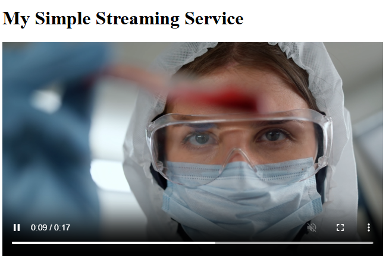

# node-streaming-service

## Docs folder contents

- Video file: `docs/1.mkv`
- Image file: `docs/1.png`

### Image preview

### Video preview

<video controls width="480">
  <source src="docs/1.mkv" type="video/x-matroska" />
  Your browser does not support the video tag.
</video>
